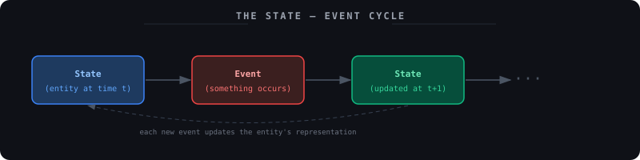
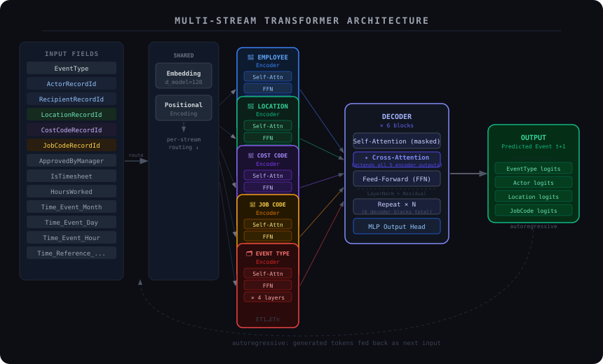
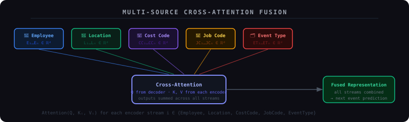
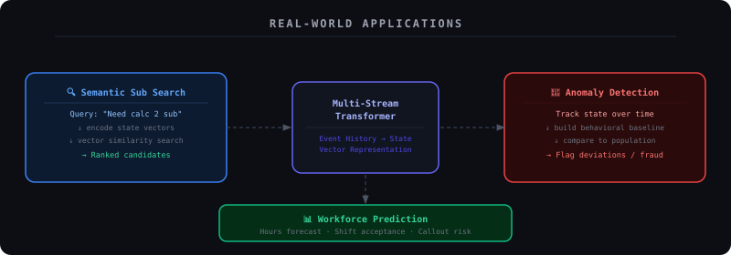

<div align="center">

# Multi-Stream Transformer
### Event Sequence Modeling for Temporal Behavioral Data

[](https://python.org)
[](https://pytorch.org)
[](https://tensorboard.dev)
[](https://docker.com)
[](LICENSE)

</div>

---

A PyTorch implementation of a multi-stream transformer architecture for structured event sequence modeling. The model processes multiple categorical input streams through independent transformer encoders, fuses them via cross-attention, and generates predictions autoregressively — applied here to workforce event data, but generalizable to any domain with temporal, multi-attribute event logs.

---

## Table of Contents

- [Motivation](#motivation)
- [Architecture](#architecture)
  - [The State–Event Cycle](#the-stateevent-cycle)
  - [Multi-Stream Encoders](#multi-stream-encoders)
  - [Cross-Attention Decoder](#cross-attention-decoder)
  - [Autoregressive Generation](#autoregressive-generation)
- [Applications](#applications)
- [Project Structure](#project-structure)
- [Installation](#installation)
- [Usage](#usage)
  - [Training](#training)
  - [Monitoring](#monitoring)
  - [Inference](#inference)
- [Configuration](#configuration)
- [Docker](#docker)
- [Technical Details](#technical-details)
- [Roadmap](#roadmap)

---

## Motivation

Most transformer research is built around sequences of tokens — words, subwords, characters. Structured event data presents a different problem: each timestep is not a single token but a *tuple* of categorical attributes occurring simultaneously.

Consider an employee clocking in. That single event carries: who did it, where, under which job code, which cost code, whether it was timesheet-approved, and when. Flattening these into a single embedding discards the relational structure between them.

This project keeps each attribute stream separate, encoding it independently through its own transformer, then fusing all streams in a shared decoder. The result is a model that can learn both within-stream temporal patterns and cross-stream dependencies — for example, that a particular employee tends to pick up specific job codes at specific locations on certain days.

---

## Architecture

### The State–Event Cycle

The foundational modeling assumption is that every entity (a person, an account, a system) can be described as a **state** that evolves over time through **events**. These two concepts are inseparable:

<div align="center">

</div>

> *State* is the representation of an entity at a specific point in time.  
> *Event* is something that occurs, which is used to update that representation.

This creates a natural learning objective: given a history of events and the states they produced, predict the next event. The model encodes this cycle directly — encoder streams capture the state implied by past events, and the decoder predicts what comes next.

---

### Multi-Stream Encoders

Each categorical dimension of an event is routed to its own dedicated transformer encoder. Rather than projecting all fields into a single joint embedding at the input, the model learns independent contextualized representations for each stream before any cross-stream reasoning occurs.

<div align="center">

</div>

The five encoder streams are:

| Stream | Field(s) | What it captures |
|--------|----------|-----------------|
| 👤 **Employee** | `ActorRecordId`, `RecipientRecordId` | *Who* was involved in the event |
| 📍 **Location** | `LocationRecordId` | *Where* the event occurred |
| 🏢 **Cost Code** | `CostCodeRecordId` | *Which project or department* |
| 💼 **Job Code** | `JobCodeRecordId` | *What role or position* |
| 🗂️ **Event Type** | `EventType` | *What kind* of event it was |

Each encoder is a standard transformer encoder stack (self-attention + FFN + layer norm + residuals), configured with 4 layers by default. All streams share the same positional encoding scheme but maintain independent weights — allowing each to develop representations appropriate for its own vocabulary and distributional patterns.

Temporal and metadata fields (`HoursWorked`, `IsTimesheet`, `ApprovedByManagerUserRecordId`, and all time components) are concatenated as auxiliary features at the embedding stage, giving every encoder access to shared temporal context without routing them through a dedicated stream.

---

### Cross-Attention Decoder

The decoder receives the output representations from all five encoders and fuses them through **multi-source cross-attention** — querying each encoder output independently and summing the results, rather than concatenating all encoder states into a single memory tensor.

<div align="center">

</div>

This design choice matters for two reasons. First, it preserves stream independence through the fusion step, so each encoder's contribution to the final prediction remains separable and interpretable. Second, it avoids the quadratic memory cost that would come from concatenating all encoder outputs before attention.

Each decoder block consists of:
1. **Masked self-attention** — the decoder attends to its own previously generated tokens (causal masking enforces autoregressive generation)
2. **Multi-source cross-attention** — queries from the decoder attend to keys and values from each encoder stream, outputs summed
3. **Feed-forward network** — two-layer MLP with GELU activation
4. **Layer normalization and residual connections** throughout

The decoder runs 6 blocks by default, followed by an MLP output head that projects to logits for each of the 17 predicted categorical fields.

---

### Autoregressive Generation

At inference time, the model generates event sequences one timestep at a time. The initial input is a start-of-sequence token; at each step, the highest-probability (or sampled) event is appended to the sequence and fed back in as context for the next prediction — identical to how autoregressive language models generate text.

```python
generated = model.generate(
    src_events=source_sequence,
    max_length=100,
    temperature=0.8       # 1.0 = unmodified, <1.0 = sharper, >1.0 = more diverse
)
```

Temperature scaling is applied to the logits before sampling, giving control over the diversity–fidelity tradeoff at inference time.

---

## Applications

The model is designed around three core use cases, each of which follows from the state–event cycle:

<div align="center">

</div>

### Semantic Substitute Search

Each employee's event history is encoded into a state vector — a dense representation of their behavioral profile. These vectors are stored in a searchable index. When a substitute is needed, a query (e.g., *"need someone to cover a morning shift at Lincoln High, Calculus 2"*) is embedded and matched against stored state vectors by similarity.

Unlike keyword search over résumé fields, this approach captures behavioral patterns: who actually shows up, who is reliable at specific locations, who has worked specific job codes recently. The state vector reflects what an employee *does*, not just what they list.

### Anomaly and Fraud Detection

Once each employee has a behavioral fingerprint — a characteristic distribution over states through time — deviations become detectable. The model can flag:

- Punch patterns that are statistically inconsistent with an employee's history
- Impossible overlapping events (clocking in at two locations simultaneously)
- Timesheet submissions that deviate from approved shift structure
- Accounts whose event distributions resemble known fraud profiles

The representations also serve as training signal for a downstream classifier, where labeled fraud cases can be used to fine-tune a detection head on top of the frozen encoder.

### Workforce Forecasting

Given a partial event history, the autoregressive decoder predicts the most likely continuation — enabling estimates of weekly hours, shift acceptance probability, or callout risk. These predictions can be aggregated across a workforce to produce staffing forecasts.

---

## Project Structure

```
multi-stream-transformer/
│
├── data/
│   ├── __init__.py
│   └── events_loader.py          # Synthetic event generator with realistic temporal correlations
│
├── modeling/
│   ├── models/
│   │   ├── __init__.py
│   │   └── model.py              # Full architecture: encoders, decoder, generation
│   ├── train_model.py            # Training pipeline with checkpointing and logging
│   └── training_config.json      # All hyperparameters
│
├── utils/
│   ├── __init__.py
│   ├── metrics.py                # Perplexity, per-stream accuracy, evaluation helpers
│   └── visualization.py          # Loss curves, attention maps, state space plots
│
├── tests/
│   ├── __init__.py
│   └── test_model.py             # Unit tests covering shapes, forward pass, generation
│
├── examples/
│   ├── __init__.py
│   └── basic_usage.py            # End-to-end example, runs in ~2 min on CPU
│
├── assets/                        # Diagrams referenced in this README
├── docker-compose.yml
├── Training.Dockerfile
├── Tensorboard.Dockerfile
├── requirements.txt
└── LICENSE
```

---

## Installation

**Prerequisites:** Python 3.8+, PyTorch 2.0+. A CUDA-capable GPU is recommended for full training but not required for the example or tests.

```bash
git clone <repository-url>
cd multi-stream-transformer

python -m venv venv
source venv/bin/activate          # Windows: venv\Scripts\activate

pip install -r requirements.txt
```

Verify the setup:

```bash
python -c "import torch; print(f'PyTorch {torch.__version__}, CUDA: {torch.cuda.is_available()}')"
python -m pytest tests/ -v
```

All tests should pass on both CPU and GPU.

---

## Usage

### Training

Run with default configuration:

```bash
python -m modeling.train_model
```

With a custom run name (logs saved to `runs/<name>/`):

```bash
python -m modeling.train_model --run-name experiment-v1
```

Resume from a checkpoint:

```bash
python -m modeling.train_model --resume runs/2024-01-15_09-30/checkpoint_best.pt
```

Use a different config file:

```bash
python -m modeling.train_model --config modeling/config_large.json
```

Training saves three checkpoint types under `runs/<timestamp>/`:

| File | Contains |
|------|----------|
| `checkpoint_latest.pt` | Most recent epoch |
| `checkpoint_best.pt` | Best validation loss |
| `checkpoint_epoch_N.pt` | Epoch-specific snapshots |

---

### Monitoring

Start TensorBoard in a separate terminal:

```bash
tensorboard --logdir runs --port 6006
```

Then open `http://localhost:6006`. Tracked metrics include:

- **Loss/Total** — overall train and validation loss
- **Loss/[StreamName]** — per-stream loss breakdown (useful for diagnosing which streams are harder to learn)
- **Learning_Rate** — warmup and decay schedule
- **Time/Step** — training throughput

---

### Inference

Load a trained checkpoint and generate sequences:

```python
import torch
from modeling.models.model import Model

checkpoint = torch.load('runs/<timestamp>/checkpoint_best.pt')
model = Model(**checkpoint['config']['model'])
model.load_state_dict(checkpoint['model_state_dict'])
model.eval()

with torch.no_grad():
    generated = model.generate(
        src_events=source_data,
        max_length=100,
        temperature=0.8
    )
```

---

## Configuration

All hyperparameters are set in `modeling/training_config.json`:

```json
{
    "src_seq_len": 200,
    "tgt_seq_len": 300,
    "epochs": 100,
    "batch_size": 16,
    "learning_rate": 3e-4,
    "warmup_steps": 400,
    "grad_clip": 1.0,
    "model": {
        "d_model": 128,
        "num_heads": 8,
        "encoder_layers": 4,
        "decoder_layers": 6,
        "dropout": 0.1,
        "dim_feedforward": 512
    },
    "vocab": {
        "event_type_size": 50,
        "actor_size": 1000,
        "location_size": 200,
        "cost_code_size": 100,
        "job_code_size": 150
    }
}
```

**Scaling guide:**

| Goal | Recommended changes |
|------|-------------------|
| Fast iteration / debugging | `d_model: 64`, `encoder_layers: 2`, `decoder_layers: 3`, `src_seq_len: 64` |
| Balanced (default) | `d_model: 128`, 4/6 layers, `batch_size: 16` |
| High capacity | `d_model: 256`, `encoder_layers: 6`, `decoder_layers: 8`, `dim_feedforward: 1024` |
| GPU memory constrained | Reduce `batch_size`, increase gradient accumulation steps |
| Longer context | Increase `src_seq_len` and `tgt_seq_len` proportionally |

---

## Docker

The repository includes a two-container Docker setup — one for training, one for TensorBoard — connected via a shared volume.

```bash
docker-compose up --build
```

Training starts automatically. TensorBoard is available at `http://localhost:6006`. Checkpoints are persisted to the host through the shared volume, so they survive container restarts.

---

## Technical Details

### Predicted Output Fields

The model predicts 17 categorical fields per timestep:

| Category | Fields |
|----------|--------|
| Core event | `EventType`, `ActorRecordId`, `RecipientRecordId` |
| Context | `LocationRecordId`, `CostCodeRecordId`, `JobCodeRecordId` |
| Metadata | `IsTimesheet`, `HoursWorked`, `ApprovedByManagerUserRecordId` |
| Event time | `Time_Event_Month`, `Time_Event_Day`, `Time_Event_Hour`, `Time_Event_Minute` |
| Reference time | `Time_Reference_Month`, `Time_Reference_Day`, `Time_Reference_Hour`, `Time_Reference_Minute` |

Each field has its own output head (linear projection to vocabulary size), and the training loss is the sum of cross-entropy losses across all fields.

### Design Decisions

**Separate encoders over a joint embedding.** Concatenating all fields at the input and projecting through a single encoder is simpler, but conflates streams that have very different vocabulary sizes, distributional properties, and temporal dynamics. Keeping them separate lets each encoder specialize, and makes stream-level contribution to predictions interpretable.

**Summed cross-attention over concatenated memory.** Concatenating all encoder outputs before cross-attention scales quadratically with the number of streams. Summing independent cross-attention outputs keeps complexity linear in the number of streams while preserving the ability to weight each encoder's contribution differently per query.

**Learned positional encodings.** Sinusoidal encodings assume a specific frequency structure that may not match event sequence statistics. Learned encodings let the model determine what positional information is actually useful for this domain.

### Extending to Real Data

The `EventsLoader` class in `data/events_loader.py` generates synthetic data with configurable temporal correlations. To plug in real data, subclass it and override `__getitem__`:

```python
class RealEventsLoader(EventsLoader):
    def __init__(self, data_path: str, **kwargs):
        super().__init__(**kwargs)
        self.df = pd.read_csv(data_path, parse_dates=['timestamp'])

    def __getitem__(self, idx: int) -> dict:
        row = self.df.iloc[idx]
        return {
            'event_type': torch.tensor(row['event_type_id'], dtype=torch.long),
            'actor':      torch.tensor(row['actor_id'],      dtype=torch.long),
            'location':   torch.tensor(row['location_id'],   dtype=torch.long),
            'cost_code':  torch.tensor(row['cost_code_id'],  dtype=torch.long),
            'job_code':   torch.tensor(row['job_code_id'],   dtype=torch.long),
        }
```

---

## Roadmap

- [x] Multi-stream encoder / cross-attention decoder
- [x] Autoregressive generation with temperature control
- [x] Full training pipeline with warmup, grad clipping, checkpointing
- [x] TensorBoard integration (loss, per-stream metrics, LR schedule)
- [x] Docker containerization
- [x] Synthetic data generator with temporal correlations
- [x] Unit test suite
- [ ] Beam search decoding
- [ ] Attention map visualization per stream
- [ ] Real data adapter (CSV / JSON / database)
- [ ] FastAPI inference endpoint
- [ ] ONNX export for production deployment
- [ ] Downstream classification head for fraud detection fine-tuning

---

## Further Reading

- [Attention Is All You Need](https://arxiv.org/abs/1706.03762) — the original transformer paper
- [Attention (machine learning)](https://en.wikipedia.org/wiki/Attention_(machine_learning)) — Wikipedia overview
- [Hidden Markov Models](https://en.wikipedia.org/wiki/Hidden_Markov_model) — the classical predecessor to learned sequence modeling

---

## License

MIT — see [LICENSE](LICENSE) for details.
